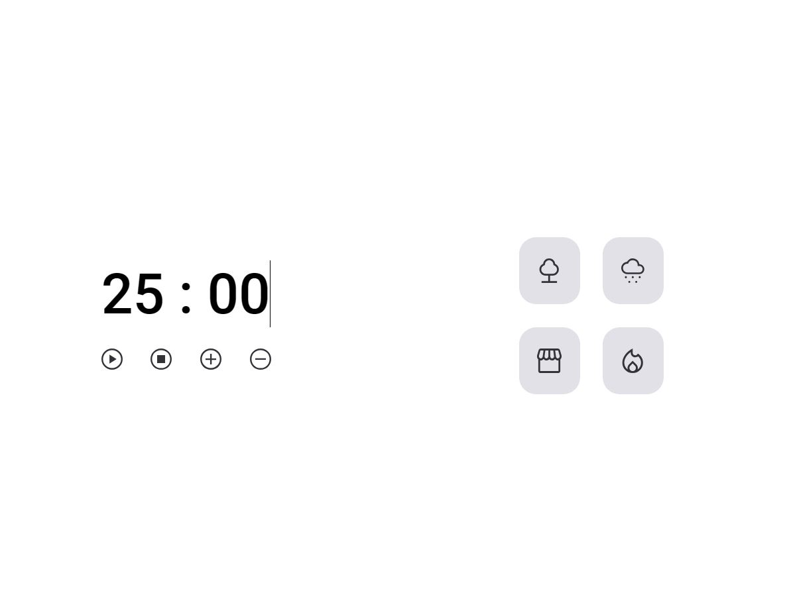
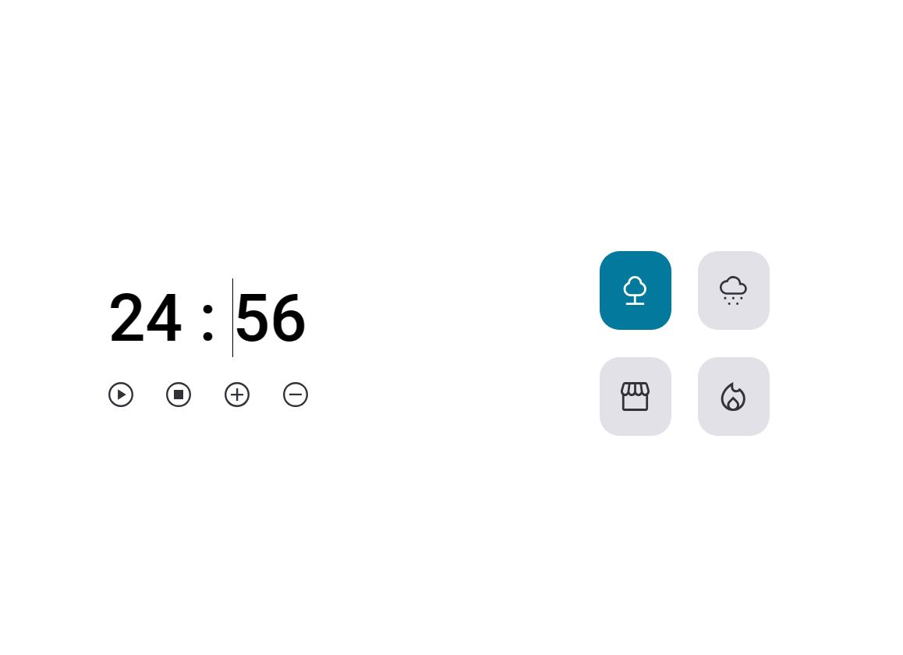

<h1 align="center">FocusTimer - Versão 2.0</h1>

Esse desafio tem como objetivo de criar um jogo chamado FocusTimer, no qual cada card que se encontra do lado direito, quando selecionado, vai mudar de cor e emitir um som diferente. Funcionalidades esperadas dos botões:

- Play: aciona o timer;
- Stop: para o timer;
- +: aumenta em mais 5 minutos o tempo do timer;
- -: diminui em 5 minutos o tempo do timer.

  <a href="#-tecnologias">Tecnologias</a>&nbsp;&nbsp;&nbsp;|&nbsp;&nbsp;&nbsp;
  <a href="#-layout">Layout</a>&nbsp;&nbsp;&nbsp;|&nbsp;&nbsp;&nbsp;
  <a href="#memo-licença">Licença</a>

  

 

  

  

## 🚀 Tecnologias

Esse projeto foi desenvolvido com as seguintes tecnologias:

- HTML, CSS e JS
- Git e Github
- Figma

## 🔖 Layout

Você pode visualizar o layout do projeto através [desse link](https://www.figma.com/file/wmeVeFY53WkXS4AIBOcic9/Stage-05---Focus-Timer-2.0-(Copy)?type=design&node-id=0-1&t=5EEuZXaiPgUtii0m-0). É necessário ter conta no [Figma](https://figma.com) para acessá-lo.

## 📝 Licença

Esse projeto está sob a licença MIT.

---

Feito com ♥ by Isabela